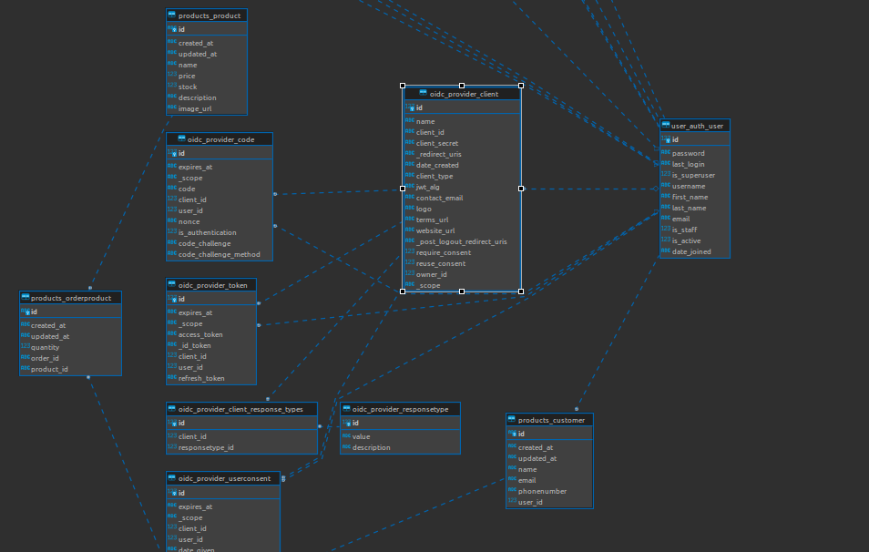
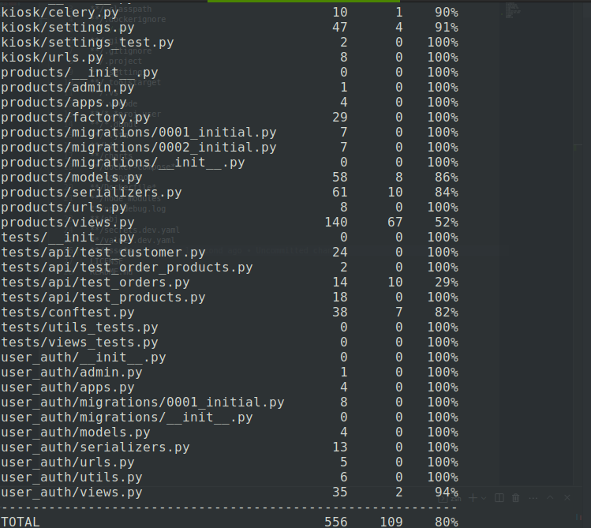

# Kiosk.Backend (Savannah Informatics)

This project was developed as part of an interview evaluation process with Savannah Informatics.

# Read The Docs

## Swagger

[https://kiosk-api.azurewebsites.net/]()

## Redocs

[https://kiosk-api.azurewebsites.net/redoc]()

## PostMan Collection

[](https://app.getpostman.com/run-collection/18483082-d8f9f954-4126-4de3-8a01-dae6d37940f7?action=collection%2Ffork&collection-url=entityId%3D18483082-d8f9f954-4126-4de3-8a01-dae6d37940f7%26entityType%3Dcollection%26workspaceId%3D1a9dcbf2-a7ea-43bb-b6a7-d25bc66dcb08)

# DataBase Schema



# Run Locally without Docker

1. create a virtual environement

```bash
python3 -m virtualenv venv
```

2. Activate the virtual environment

```bash
source venv/bin/activate
```

3. Install required dependancies

```bash
pip install -r requirements.txt
```

4. Then run the command below

```python

python3 manage.py runserver

```

# Run Locally with Docker

```bash
docker-compose  up --build
```

# Run Tests

```bash
pytest tests/ -v

```

# check Code Coverage

```bash
coverage run -m pytest

coverage report

```

## sample report



# Tools & Technologies

## lanuages and Frameworks

- [Django (Python)](https://fastapi.tiangolo.com/)
  Django REST framework is a powerful and flexible toolkit for building Web **APIs** with Python 3.7+ based on standard Python.

## Testing & Code Coverage

- [pytest](https://docs.pytest.org/en/7.4.x/)
  The pytest framework makes it easy to write small, readable tests, and can scale to support complex functional testing for applications and libraries.
- [coverage](https://coverage.readthedocs.io/en/7.3.1/)
  Coverage measurement is typically used to gauge the effectiveness of tests. It can show which parts of your code are being exercised by tests, and which are not.

## CI/CD

- [GithubAction](https://github.com/features/actions)
  GitHub Actions makes it easy to automate all your software workflows, now with world-class CI/CD. Build, test, and deploy your code right from GitHub. Make code reviews, branch management.
